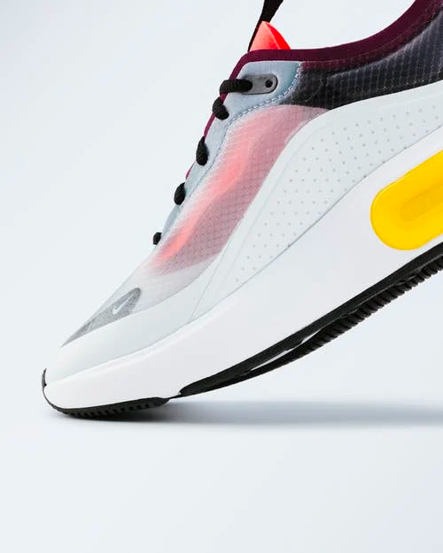

  

    

      <h2 class="shoe-heading">Keep it sporty.</h2>
      
Our mission is to change the world through sport. Browse sportswear and shoes.

      <button class="shoe-btn">View Collection</button>
    

    

      
    

  

